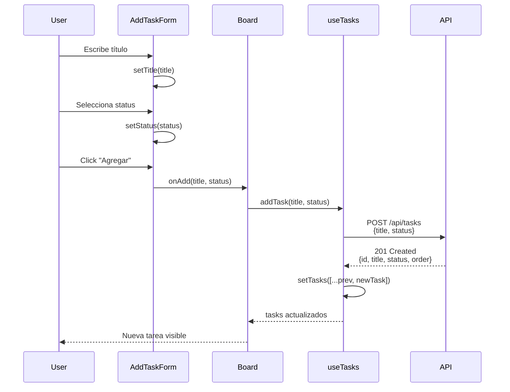
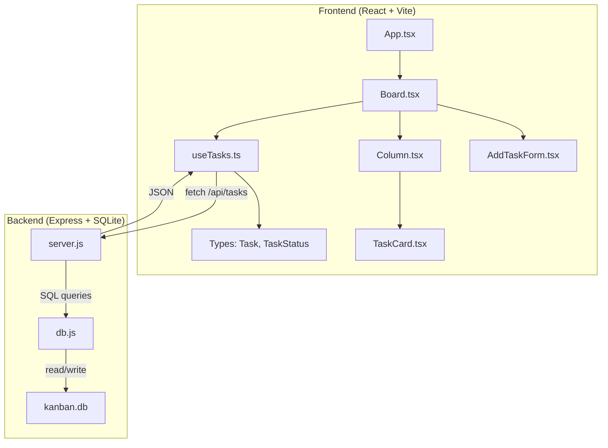

# Frontend - Agregar Tarea - Análisis

## Explicación

Componente `AddTaskForm.tsx` - Formulario controlado de React para crear tareas en el tablero Kanban.

### Flujo de datos

| Paso | Acción | Archivo |
|------|--------|---------|
| 1 | Usuario escribe título | `AddTaskForm.tsx` - `setTitle()` |
| 2 | Usuario selecciona status | `AddTaskForm.tsx` - `setStatus()` |
| 3 | Submit → llama `onAdd()` | `AddTaskForm.tsx` - `handleSubmit()` |
| 4 | Pasa a `useTasks.addTask()` | `Board.tsx` → `useTasks.ts` |
| 5 | Envía POST a `/api/tasks` | `useTasks.ts` - `fetch()` |
| 6 | Actualiza estado local | `useTasks.ts` - `setTasks()` |

### Patrones de diseño

| Patrón | Implementación |
|--------|----------------|
| **Controlled Components** | Inputs con `value` + `onChange` |
| **Props Pattern** | Callback `onAdd` via props |
| **Hook-based state** | `useState` local |
| **Component Composition** | Props drilling Board → AddTaskForm |

---

## Código

### AddTaskForm.tsx

```tsx
// frontend/src/components/AddTaskForm.tsx
import React, { useState } from 'react';
import { TaskStatus } from '../types';

interface AddTaskFormProps {
  onAdd: (title: string, status: TaskStatus) => Promise<void>;
}

const AddTaskForm: React.FC<AddTaskFormProps> = ({ onAdd }) => {
  const [title, setTitle] = useState('');
  const [status, setStatus] = useState<TaskStatus>('pending');

  const handleSubmit = async (e: React.FormEvent) => {
    e.preventDefault();
    if (!title.trim()) return;  // Solo validación local
    await onAdd(title, status);
    setTitle('');  // Reset título, NO el status
  };

  return (
    <form onSubmit={handleSubmit}>
      <input
        type="text"
        value={title}
        onChange={(e) => setTitle(e.target.value)}
        placeholder="Título de la tarea"
      />
      <select value={status} onChange={(e) => setStatus(e.target.value as TaskStatus)}>
        <option value="pending">Pendiente</option>
        <option value="in-progress">En Progreso</option>
        <option value="done">Hecho</option>
      </select>
      <button type="submit">Agregar</button>
    </form>
  );
};

export default AddTaskForm;
```

### Integración con Board.tsx

```tsx
// frontend/src/components/Board.tsx
import { useTasks } from '../hooks/useTasks';

const Board: React.FC = () => {
  const { tasks, addTask } = useTasks();

  return (
    <div className="board">
      <AddTaskForm onAdd={addTask} />
      {/* Columns */}
    </div>
  );
};
```

### useTasks.addTask()

```typescript
// frontend/src/hooks/useTasks.ts
const addTask = async (title: string, status: TaskStatus) => {
  const res = await fetch('/api/tasks', {
    method: 'POST',
    headers: { 'Content-Type': 'application/json' },
    body: JSON.stringify({ title, status }),
  });
  if (!res.ok) {
    return;  // Bug #7: falla silenciosamente
  }
  const newTask = await res.json();
  setTasks(prev => [...prev, newTask]);
};
```

---

## Diagramas

### Diagrama de componentes

```mermaid
graph TD
    App[App.tsx] --> Board[Board.tsx]
    Board --> AddTaskForm[AddTaskForm]
    Board --> Column1[Column: Pending]
    Board --> Column2[Column: In-Progress]
    Board --> Column3[Column: Done]
    Column1 --> TaskCard1[TaskCard]
    Column2 --> TaskCard2[TaskCard]
    Column3 --> TaskCard3[TaskCard]
    Board --> useTasks[useTasks.ts]
    useTasks --> API[/api/tasks]
```

### Flujo de datos: Crear tarea



### Arquitectura frontend



### Flujo de validación

```mermaid
flowchart TD
    A[Submit Form] --> B{title.trim() === ''}
    B -->|Sí| C[No enviar]
    B -->|No| D[onAdd(title, status)]
    D --> E[fetch POST /api/tasks]
    E --> F{Respuesta ok?}
    F -->|No| G[Return - Bug #7]
    F -->|Sí| H[setTasks([...prev, newTask])]
    G --> I[Sin feedback al usuario]
    H --> J[Tarea visible]
```

---

## Bugs intencionales relacionados

| Bug # | Descripción | Ubicación | Impacto |
|-------|-------------|-----------|---------|
| #7 | Errores silenciosos | `useTasks.ts:20-22` | Usuario no sabe si falló |
| #2 (Backend) | Sin validación title/status | `server.js:25-38` | Acepta títulos vacíos |
| #8 | Sin indicador de carga | `useTasks.ts:6` | Sin feedback visual |

---

## Tipos relacionados

```typescript
// frontend/src/types/index.ts
export type TaskStatus = 'pending' | 'in-progress' | 'done';

export interface Task {
  id: number;
  title: string;
  status: TaskStatus;
  order: number;
}
```

---

## Estilos CSS

```css
/* frontend/src/App.css - Formulario */
form {
  display: flex;
  gap: 10px;
  margin-bottom: 20px;
}

input {
  flex: 1;
  padding: 8px;
  border: 1px solid #ddd;
  border-radius: 4px;
}

select {
  padding: 8px;
  border: 1px solid #ddd;
  border-radius: 4px;
}

button[type="submit"] {
  padding: 8px 16px;
  background: #8b5cf6;
  color: white;
  border: none;
  border-radius: 4px;
  cursor: pointer;
}
```
