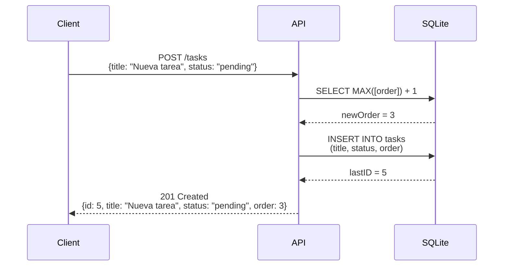
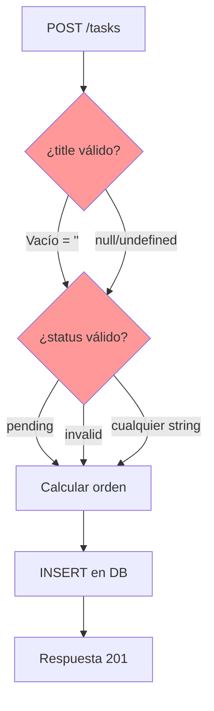
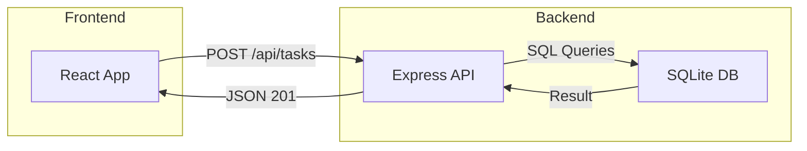

# POST /tasks - Análisis

## Explicación

Endpoint que crea una nueva tarea en la base de datos SQLite.

### Flujo de ejecución

| Paso | Acción | Código |
|------|--------|--------|
| 1 | Extrae `title` y `status` del body | `const { title, status = 'pending' } = req.body;` |
| 2 | Calcula el siguiente orden | `SELECT COALESCE(MAX([order]), 0) + 1 as newOrder FROM tasks` |
| 3 | Inserta la tarea en SQLite | `INSERT INTO tasks (title, status, [order]) VALUES (?, ?, ?)` |
| 4 | Retorna 201 con los datos | `res.status(201).json({ id, title, status, order })` |

---

## Código

```javascript
// backend/src/server.js:25-38
app.post('/tasks', (req, res) => {
  const { title, status = 'pending' } = req.body;
  const orderQuery = "SELECT COALESCE(MAX([order]), 0) + 1 as newOrder FROM tasks";
  db.get(orderQuery, (err, row) => {
    if (err) return res.status(500).json({ error: err.message });
    const newOrder = row.newOrder;
    db.run("INSERT INTO tasks (title, status, [order]) VALUES (?, ?, ?)",
      [title || '', status, newOrder],
      function(err) {
        if (err) return res.status(500).json({ error: err.message });
        res.status(201).json({ id: this.lastID, title, status, order: newOrder });
      });
  });
});
```

---

## Diagramas

### Secuencia: Crear tarea



### Flujo: Validación (ausente)



### Arquitectura general



---

## Bugs intencionales

| Bug | Descripción | Impacto |
|-----|-------------|---------|
| Sin validación de título | Acepta títulos vacíos (`''`) | Tareas sin nombre |
| Sin validación de status | Acepta cualquier string como status | Estados inválidos en DB |
| Condición de carrera | Queries no atómicas bajo alta concurrencia | Posibles órdenes duplicados |

---

## Request/Response ejemplo

**Request:**
```http
POST /tasks
Content-Type: application/json

{
  "title": "Diseñar UI",
  "status": "pending"
}
```

**Response (201):**
```json
{
  "id": 5,
  "title": "Diseñar UI",
  "status": "pending",
  "order": 3
}
```
